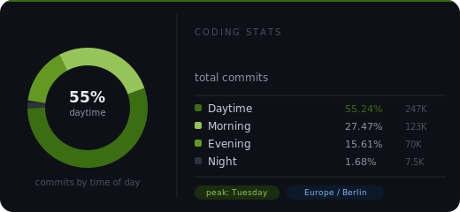

# Nisarg Patel

**Full-Stack Developer · Frankfurt, Germany**

<!--AGE_START-->23<!--AGE_END--> y/o · building scalable full-stack features at EVER Health GmbH · writing clean code by day

---

## about me

I'm a full-stack developer currently working at [EVER Health GmbH](https://www.linkedin.com/company/ever-health-ai/) in Germany, where I handle everything from frontend to production — feature development, backend APIs, database migrations, and AWS deployments.

I care about writing code that's readable, systems that scale, and interfaces that feel good to use.

- 🏢 &nbsp;**Role** — Software Developer @ EVER Health GmbH, Lahnau
- 🌍 &nbsp;**Based in** — Frankfurt Rhine-Main, Germany
- 📬 &nbsp;**Reach me** — patelnisarg1309@gmail.com

---

## tech stack

**daily drivers**

  
  
  
  
  
  
  
  
  
  

**also worked with**

  
  
  
  
  
  
  
  

---

## coding stats

  

  
  

---

  updated daily · <a href="https://nisarg-patel-13.vercel.app/">nisarg-patel-13.vercel.app</a>

